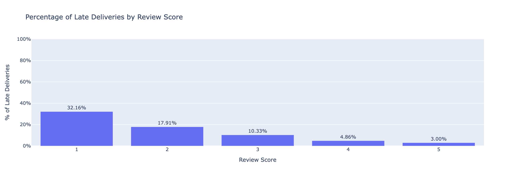

# **Breaking Bottlenecks: Delivery Gameplan for Olist**
Courtesy of Team Alpha (DTIDSOL-02):
- Josephine Rahma Gunawan
- Rio Pramana
- Risma Widiya Puspadevi

### About Olist 
Olist is a *Brazilian e‑commerce technology startup, founded in **February 2015* in Curitiba by *Tiago Dalvi—spinning off from his earlier artisan‑marketplace Solidarium from 2007 ([Wikipedia][1]). It's not a traditional marketplace but operates as a **commerce enabler*: small and medium‑sized retailers upload their product catalogs to Olist’s platform, and Olist handles listings across major marketplaces like Amazon, Mercado Livre, B2W, logistics, and financial services ([Digitopia][2]).

### How was Olist in 2018?

* By *2018, Olist had already secured significant **Series B funding*, fueling growth in its services beyond marketplace integrations—moving into logistics and merchant capital ([Canvas Templates for Startups][3]).
* It was considered a promising *centaur startup* with over *12,000 retailers* connected through a single platform to 13 marketplaces, fully automating their e‑commerce operations ([Digitopia][2]).
* Investors backing included *Redpoint eventures, 500 Startups, and notably **SoftBank Vision Fund* around 2018-2019 ([Digitopia][2]).

So in 2018, Olist was *well past its seed stage*, entering growth mode with institutional backing, expanding its merchant network, and branching into logistics and financial tools. By 2018, Olist was still very much a “growth-first” venture-backed startup, so it’s reasonable to assume that protecting long-term customer growth and satisfaction would outweigh short-term cost optimisation.

---

References : 
[1]: https://pt.wikipedia.org/wiki/Olist?utm_source=chatgpt.com "Olist"
[2]: https://digitopia.co/blog/digital-change-for-brazilians/?utm_source=chatgpt.com "Digital Change for Brazilians - Digitopia"
[3]: https://canvasbusinessmodel.com/blogs/brief-history/olist-brief-history?srsltid=AfmBOop5ylU1kid-EtArG6DMLWqBgXxEMuYJqKMM0fxfOUDJOBX4No79&utm_source=chatgpt.com "What is Brief History of Olist Company? – CanvasBusinessModel.com"

## **Data Analysis**

**Understanding the Business Problems**

### Background and Business Objective

E-commerce has rapidly transformed how people shop, especially in Brazil, where convenience, price, and speed play crucial roles in consumer decisions. According to a report by **NielsenIQ**, Brazilian shoppers cited the following top reasons for choosing online platforms:

- **77%** – Best price  
- **57%** – Delivery time  
- **54%** – Product variety  
- **39%** – Special promotions (e.g., free shipping, discounts, loyalty programmes)

The fact that *delivery time* ranks second highlights just how important a fast, reliable shipping experience is to customers (nearly as important as pricing itself).

For **Olist**, a major e-commerce platform that connects small and medium-sized retailers to marketplaces in Brazil, this puts increasing pressure on fulfilment operations. Delivery performance isn’t just a logistical concern. It's a business-critical metric that can influence customer satisfaction, retention, and ultimately, sales performance.

##### Why Focus on On-Time Delivery (OTD)?

To evaluate delivery performance, we focus on the industry-standard metric: **On-Time Delivery (OTD)**. OTD measures the percentage of orders delivered within the promised timeframe and is calculated as:

> **OTD (%) = (Number of on-time deliveries / Total deliveries in the period) × 100**

As highlighted in a blog by **[Delage](https://delage.com.br/blog/otd-on-time-delivery-saiba-tudo-sobre-um-dos-principais-indicadores-para-o-e-commerce/)**, OTD has become one of the most relevant indicators in e-commerce logistics today. It reflects the efficiency of the entire order fulfilment process from the time an order is picked and packed to when it’s handed off by the courier.

Importantly, a survey by **Reclame Aqui** showed that **18.6% of consumers abandon their online shopping carts** if the estimated delivery time doesn’t meet their expectations. While this figure may seem modest at first glance, nearly **1 in 5 lost sales** can severely impact an e-commerce company’s bottom line, especially at scale.

Furthermore, an article by **[Gazeta do Povo](https://www.gazetadopovo.com.br/economia/e-commerce-brasileiro-busca-alternativas-a-correiodependencia-an1xq7tj25k1nnxytsml2tb4q/)** noted that logistics companies proudly advertise achieving **95% OTD** as a sign of operational excellence. While not a formal industry standard, this 95% mark is widely regarded as a benchmark for competitive performance in Brazil’s e-commerce landscape.

##### Project Objective

Given the critical role that delivery time plays in consumer satisfaction and conversion rates, the objective of this project is to:

> **Improve Olist's delivery performance by increasing its On-Time Delivery (OTD) rate, aiming for a minimum benchmark of 95%.**

In addition to descriptive and diagnostic analysis, this project also leverages **machine learning to predict whether a delivery will be late or on time** based on various features available at the time of order. The goal is to take **preventive action** on high-risk deliveries such as prioritising processing or flagging for courier follow-up before issues occur.

Through data-driven insights and predictive modelling, this project aims to help Olist optimise its logistics performance, meet customer expectations, and improve overall business outcomes.

### Sumary of Exploratory Data Analysis 
The EDA reveals several key associations and patterns : 

We have found that late delivery and longer delivery days have association with customer's satisfaction that result in bad review scores. Also, this will impact the brand and business evaluation including potential income revenue of the Olist, since late delivary has association with lower customer retention rate.

**1. Delivery Performance, Customer Satisfaction, and Retention**
- From all orders, the late delivery and on-time delivery percentage is 7.92% vs 92.08%, respectively. 
- The Median delivery duration: 9 days (on-time) vs. 29 days (late), which has a statistical difference at p=0.00.
- Customer satisfaction is closely tied to delivery speed:
    - Longer delivery durations are correlated with lower review scores (Spearman’s ρ = -0.22).
    - Median review score for late orders is 2, compared to 5 for on-time orders.
    - The association between late delivery and lower review scores is statistically significant (Chi-Square, p=0.00).
    - Customer retention is measurably lower among those experiencing late first orders: 2.51% retention vs. 3.04% for on-time, a significant difference (Chi-Square, p<0.01).

**2. Operational and Structural Factors Affecting Delivery**
- The platform’s On-Time Delivery (OTD) rate averaged 84.9% overall, with a high of 94.85% in 2016–2017 and 90% in 2018, indicating variability during increased volume season.
- Order volume is negatively correlated with OTD (Spearman’s ρ = -0.63), suggesting logistical challenges scale with demand.
- Both seller and logistics locations contribute to delays. Regional analysis shows the Northeast, including cities like Fortaleza and Salvador, experiences higher rates of late deliveries, highlighting potential infrastructure or process bottlenecks.
- Product category influences delay: Large, seasonal, or poorly structured categories (including “unknowns”) are more likely to be late. 
- Higher freight value, a proxy for product size or shipping distance, also correlates positively with longer delivery duration (ρ = 0.42).
- Order timestamp an holidays: Orders placed at midnight show a spike in late deliveries; meanwhile holidays themselves do not significantly increase delay risk, though order volume increases prior to major holidays.
- Payment method and use of installments do not show significant associations with late delivery.

## **Machine Learning**
Here, we want to 
##### Futures Engineering 
##### Model Building 
##### Deliverables
- Tableau Dashboard: https://public.tableau.com/app/profile/risma.w.p./viz/OlistDeliveryPerformanceDashboard/Dashboard1#1

- Streamlit app: https://olist-delivery-predictor-alpha-team.streamlit.app
